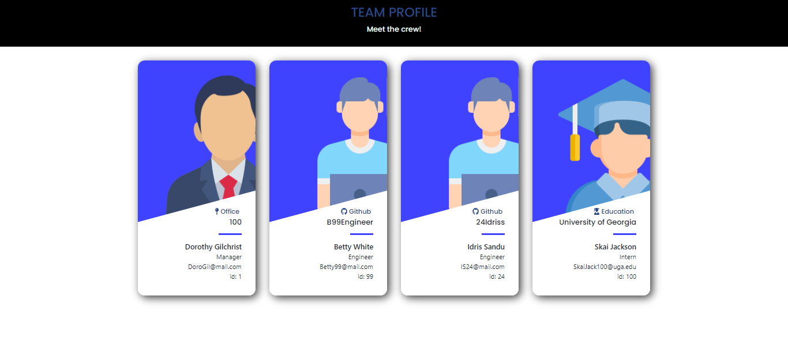

# Team Profile Generator
  https://github.com/KilowattDot/TeamProfileGen
  
  ## Description
  In this project, I was tasked with creating a generator for Manager's to create their team's profile of their information. There is e role options that consist of Manager, Engineer, and Intern in which of those have their own special criteria of information to be displayed. The questionnaire captures the role and asks for the information linked to that role outside of the basic information that they all need like email, id, and name.

  ## Table of Contents
  * [ Description](#description)
  * [ Installation](#installation)
  * [ Usage](#usage)
  * [ License](#license)
  * [ Contributing](#contributing)
  * [ Tests](#tests)
  * [ Questions](#questions)

  ## Installation
  The following necessary dependencies that must be installed to run this application:
  * npm i - inquirer, bootstrap-icons, fs, jest(for unit testing)

  ## Images
  

  
  ## License
  MIT

   
  
    https://opensource.org/licenses/MIT

  ## Contributing
   Controbutors: Dorothy Gilchrist

  ## Tests
  The following is needed to run the test: node index.js
  
  ## Questions
  * If you have any questions about the repo, open an isse or contact: github.com/KilowattDot
  * Email to reach us directly: Doro.Gilchrist@gmail.com

   

